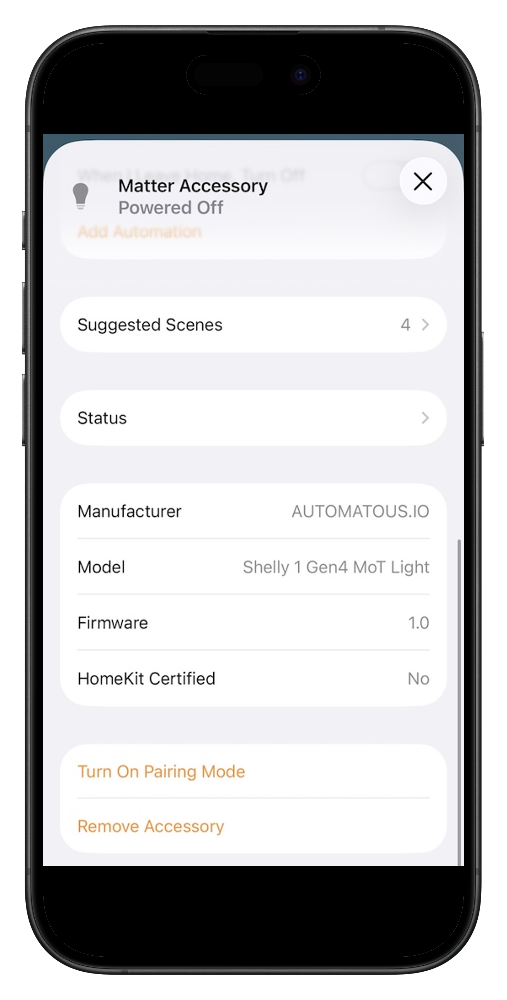

# Shelly 1 Gen4 — Matter over Thread

[](https://opensource.org/licenses/Apache-2.0)
[](../../releases/latest)

[](../../releases)
[](../../stargazers)
[](https://buymeacoffee.com/automatous.io)

> **⚠️ Disclaimer.** Installing this firmware voids your Shelly warranty, and Shelly cannot provide technical support for a device running third-party code. It removes the factory keys that enable Shelly Cloud and official OTA updates, so treat flashing as one-way unless you keep the full-chip backup you make before flashing. Incorrect flashing can brick your device, so always back up your original firmware before proceeding. You assume all responsibility for any damage, data loss, or device failure. This project is not affiliated with Shelly, Allterco Robotics, CSA, or Espressif Systems. See [Warranty, Factory Keys, and Reversibility](docs/REVERSIBILITY.md).

The first third-party open source Matter over Thread firmware for the Shelly 1 Gen4. It works natively with Apple Home, Google Home, Alexa, and Home Assistant. No Shelly app, no cloud, no WiFi. The Gen4's ESP32-C6 has an 802.15.4 radio that stock firmware uses for Zigbee. Stock firmware also supports Matter over WiFi. This firmware reconfigures the 802.15.4 radio to run Thread, which unlocks Matter over Thread.

<p align="center">
  
</p>

*Shelly 1 Gen4 running the light variant firmware, commissioned to Apple Home. Manufacturer: AUTOMATOUS.IO, Model: Shelly 1 Gen4 MoT Light.*

---

## Contents

- [Variants](#variants)
- [Quick start](#quick-start)
- [Features](#features)
- [Compatibility](#compatibility)
- [Documentation](#documentation)
- [Repository layout](#repository-layout)
- [Why?](#why)
- [About](#about)
- [In the wild](#in-the-wild)
- [Other projects from Automatous](#other-projects-from-automatous)
- [License](#license)

---

## Variants

Matter device types are declared by the firmware at flash time and cannot be changed in the smart home app after commissioning, so each behavior is a separate firmware build.

| Variant | Matter device type | Relay behavior | Good for |
|---|---|---|---|
| Light | On/Off Light *(shown as a light)* | Latching. Holds on or off until changed. | Lights and lighting circuits. |
| Outlet | On/Off Plug-in Unit *(shown as an outlet)* | Latching. Holds on or off until changed. | Outlets, plug-in appliances, fans, heaters, pumps, and other set-and-hold loads. |
| Opener | On/Off Plug-in Unit + Contact Sensor | Momentary pulse, roughly 500ms. | Garage door openers, gates, doorbells, and other pulse-activated devices. |
| Light Switch | On/Off Light + On/Off Light Switch | Latching, but the SW terminal is detached from the relay. | Repurposing the wall switch to control other Matter devices through a binding, while the local relay runs independently. |

Light and Outlet are electrically identical. Both latch and hold state, and both keep the SW terminal as a physical wall toggle. They differ only in the Matter device type they report, which sets how your smart home app names, displays, and voice-controls the device, as a light or as an outlet. Some apps let you recategorize after pairing. Others fix the icon, label, and automations to the reported type, which cannot change after commissioning. Pick the variant that matches the load you wired, so the controls read the way you expect.

The Light variant is the flagship release and the one pictured above. Power-on behavior on the latching variants (Light and Outlet) defaults to off and is configurable through the Matter StartUpOnOff attribute (off, on, toggle, or restore last state). Home Assistant users can write this attribute directly. Apple Home and Google Home have limited Matter attribute editing today, so the firmware default applies there until those apps improve.

The Light Switch variant, contributed by [Tomas McGuinness](https://github.com/tomasmcguinness), decouples the SW terminal from the local relay. Flipping the wall switch no longer toggles the wired load. Instead it sends a Matter Toggle command through a second On/Off Light Switch endpoint, which you bind to other Matter devices such as bulbs, groups, or scenes. The local relay stays on the On/Off Light endpoint and is controlled by your smart home app, by voice, and by the onboard button. Out of the box the wall switch does nothing until you configure a binding. To keep local control as well, bind the switch endpoint back to the device's own light endpoint. You can write the binding with chip-tool. Home Assistant users can use the [Matter Binding Helper](https://github.com/cedricziel/ha-matter-binding-helper) by Cedric Ziel, which makes it straightforward.

> ⚠️ This firmware uses ESP-Matter SDK test credentials and is not VID/PID certified. It is functional for personal use and not suitable for resale as a certified Matter product. See [Certification](docs/CERTIFICATION.md).

---

## Quick start

**Have a [way onto Thread](#compatibility) (a Thread Border Router or an iPhone 15 Pro or newer), a USB-UART adapter, and a 1.27mm to 2.54mm adapter? Flash and go.**

1. [Download the latest release](../../releases/latest). Grab the `.bin` for the [variant](#variants) you want, named `automatous-io-shelly-1-gen4-{variant}-vX.Y.Z.bin` (for example the `light`, `outlet`, `opener`, or `light-switch` build).
2. [Enter flash mode](docs/FLASHING.md#enter-flash-mode) on your Shelly.
3. [Back up your original firmware](docs/FLASHING.md#2-back-up-the-original-shelly-firmware) and flash the latest release with [ESPConnect](docs/FLASHING.md#flash-with-espconnect).
4. [Commission](docs/COMMISSIONING.md) with your smart home app.

The full flashing process takes about 15 minutes. See the [Flashing Guide](docs/FLASHING.md) for wiring diagrams, photos, safety warnings, and a command-line path.

It is fully reversible with the UART flashing method this guide uses. UART captures a full-chip backup of the stock firmware before flashing (step 3), including the factory keys that enable Shelly Cloud and OTA, so you can restore the device to factory state at any time with cloud and OTA intact. Stock restore is [verified working](docs/FLASHING.md#restoring-stock-firmware). That full-chip backup can only be captured over UART. Without it, flashing is one-way.

> ⚠️ **Before you start.** Never connect the Shelly to AC mains while flashing. The programming header is not galvanically isolated from mains circuitry. See [the full safety warning](docs/FLASHING.md#safety-warning).

---

## Features

- Physical button toggle on the onboard relay button.
- External wall switch input on the SW terminal.
- Configurable power-on behavior through the Matter StartUpOnOff attribute.
- Status LED indication for BLE advertising, Thread connecting, and Thread connected.
- Identify support. Blink the LED on command from any Matter controller to locate the device.
- Factory reset via long press on the onboard relay button.
- Full Thread Device mode. Adds a Thread router to your mesh for other devices.
- Multi-fabric. Commission to multiple ecosystems at once, with state synced across all of them.

---

## Compatibility

Matter over Thread needs a way onto a Thread network to commission and reach the Shelly. That can be a Thread Border Router, a device with a built-in Thread radio such as an iPhone 15 Pro or newer, or both. The table below lists tested and supported options.

| Device | Provides Thread | Tested |
|---|---|---|
| Apple HomePod mini | Yes | Yes |
| Apple HomePod (2nd gen) | Yes | Yes |
| Apple TV 4K (3rd gen) | Yes | Untested |
| iPhone 15 Pro and newer | Yes | Yes |
| Google Nest Hub (2nd gen) | Yes | Untested |
| Home Assistant (SkyConnect or Yellow) | Yes | Yes |
| Amazon Echo (4th gen) | Yes | Untested |

---

## Documentation

Everything is in [`docs/`](docs/). A typical path is to read the [Flashing Guide](docs/FLASHING.md) and its safety warning, flash the firmware, then [commission](docs/COMMISSIONING.md) the device to your smart home.

- [Why Matter over Thread](docs/WHY.md) — the rationale for Matter over Thread
- [Flashing Guide](docs/FLASHING.md) — wiring, backing up stock firmware, and flashing
- [Reversibility](docs/REVERSIBILITY.md) — warranty, factory keys, and how reversible flashing is
- [Commissioning](docs/COMMISSIONING.md) — pairing the device and reading the status LED
- [Power Consumption](docs/POWER.md) — measured draw and the Thread router design choice
- [Building from Source](docs/BUILDING.md) — compiling the firmware yourself
- [Certification](docs/CERTIFICATION.md) — uncertified status and test credentials
- [Roadmap](docs/ROADMAP.md) — current known limitations and planned work
- [Contributing](docs/CONTRIBUTING.md) — reporting bugs and the firmware filename convention
- [Changelog](CHANGELOG.md) — per-variant release history

---

## Repository layout

```
shelly-1-gen4-matter-thread/
├── README.md          This file.
├── LICENSE            Apache 2.0.
├── docs/              Documentation and the images it references.
└── source/
    └── shelly-1-gen4/
        ├── light/         Matter On/Off Light, latching relay. Released.
        ├── opener/        Matter On/Off Plug-in Unit + Contact Sensor, momentary pulse. Released.
        ├── outlet/        Matter On/Off Plug-in Unit, latching relay, SW kept as a wall toggle. Released.
        └── light-switch/  Matter On/Off Light Switch, detached relay with the SW input bound to other Matter devices. Released.
```

Each variant under `source/shelly-1-gen4/` is a self-contained ESP-IDF project. See [Building from Source](docs/BUILDING.md) for what each variant does and how to build it.

---

## Why?

The Shelly 1 Gen4's ESP32-C6 can run Thread, but stock firmware never uses it that way. This firmware repurposes the radio for Thread so the device speaks Matter directly to your smart home, with no WiFi, no cloud, and no bridge or controller required in between. For the full rationale, the comparison to ESPHome and Tasmota, and why Thread over WiFi, see [Why Matter over Thread](docs/WHY.md).

---

## About

This firmware was created from inside an old Dodge Sprinter T1N named Mabel, parked somewhere in the USA.

I put in many sleepless nights obsessing over Thread support, which kickstarted me into writing custom firmware and testing with ESP-IDF, ESP-Matter, and ESPHome examples. That meant figuring out Shelly's custom partition offsets, the GPIO quirks specific to this device, and getting Matter over Thread commissioning working on non-devkit hardware.

If it saved you the same headache, consider leaving a ⭐ on the repo. It helps the project show up in GitHub search and signals to other Shelly 1 Gen4 owners that this firmware exists and works. If you would like to support the work directly, you can [buy me a coffee](https://buymeacoffee.com/automatous.io).

---

## In the wild

Press, blog posts, and mentions of the project.

- [Shelly relay switches finally run on Thread with open-source firmware](https://www.matteralpha.com/news/shelly-relay-switches-finally-run-on-thread-with-open-source-firmware) — Matter Alpha, May 2026
- [Shelly Gen 4: Custom-Firmware bringt Unterstützung für Matter over Thread](https://stadt-bremerhaven.de/shelly-gen-4-custom-firmware-bringt-unterstuetzung-fuer-matter-over-thread/) — Caschys Blog, May 2026 (German)
- [Community discussion on r/homeassistant](https://www.reddit.com/r/homeassistant/comments/1t8bv8q/made_an_open_source_matter_over_thread_firmware/) — Reddit, May 2026
- [Jonathan Hui of the Thread Group / CSA highlights the project](https://www.linkedin.com/posts/jonathanhui_from-the-homeassistant-community-on-reddit-share-7459779233565925377-KUMe/) — LinkedIn, May 2026

---

## Other projects from Automatous

Other open source, local-first, Matter over Thread projects from Automatous.

| Project | What it is |
|---|---|
| [T1N Smart Lock](https://github.com/automatous-io/t1n-smart-lock) | Open source Matter over Thread smart lock that integrates with the factory central locking on a 2005 Dodge Sprinter 2500 (T1N chassis). Observation based, OEM respectful. |

---

## License

Apache 2.0. See [LICENSE](LICENSE).

Based on the [ESP-Matter](https://github.com/espressif/esp-matter) light example by Espressif Systems, licensed under Apache 2.0. The Opener and Outlet variants' Matter device composition was informed by the esp-matter `on_off_plugin_unit` example, and the Light Switch variant's by the esp-matter `light_switch` example.
